[comment]: # (This presentation was made with markdown-slides)
[comment]: # (This is a CommonMark compliant comment. It will not be included in the presentation.)
[comment]: # (Compile this presentation with the command below)
[comment]: # (mdslides presentation.md --include media)

[comment]: # (Set the theme:)
[comment]: # (THEME = serif)
[comment]: # (CODE_THEME = base16/zenburn)
[comment]: # (The list of themes is at https://revealjs.com/themes/)
[comment]: # (The list of code themes is at https://highlightjs.org/)

[comment]: # "You can also use quotes instead of parenthesis"
[comment]: # 'Single quotes work too'
[comment]: # "THEME = white"

[comment]: # (Pass optional settings to reveal.js:)
[comment]: # (controls: true)
[comment]: # (keyboard: true)
[comment]: # (markdown: { smartypants: true })
[comment]: # (hash: false)
[comment]: # (respondToHashChanges: false)
[comment]: # (Other settings are documented at https://revealjs.com/config/)

# Unlock the Power of Git

----------

*How to live happily ever after with git*
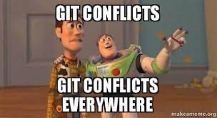

IDA Conference Oct 2025
©Charlotte Moreno Møller


[comment]: # (!!!)

## Outline
- Why version control and what is Git? <!-- .element: class="fragment" data-fragment-index="1" -->
- Git basics: vocabulary and workflow <!-- .element: class="fragment" data-fragment-index="2" -->
- Working in isolation - branches, merge and merge conflicts <!-- .element: class="fragment" data-fragment-index="3" -->
- A closer look at how Git keeps track of changes <!-- .element: class="fragment" data-fragment-index="4" -->
- Exploring your code history <!-- .element: class="fragment" data-fragment-index="5" -->
- Where to go from here <!-- .element: class="fragment" data-fragment-index="6" -->

[comment]: # (!!!)

## Why version control 
and 
## what is Git?

[comment]: # (|||)

*Does this look familiar?*

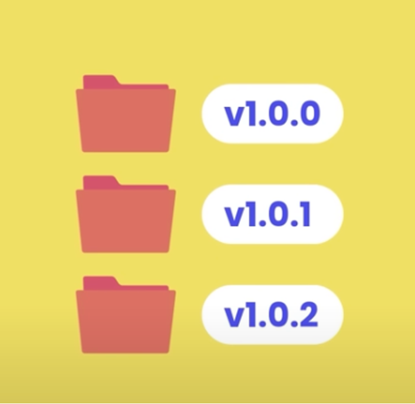<!-- .element: style="height:20vh; max-width:40vw; image-rendering: crisp-edges;" -->

[comment]: # (|||)

*Or this?*

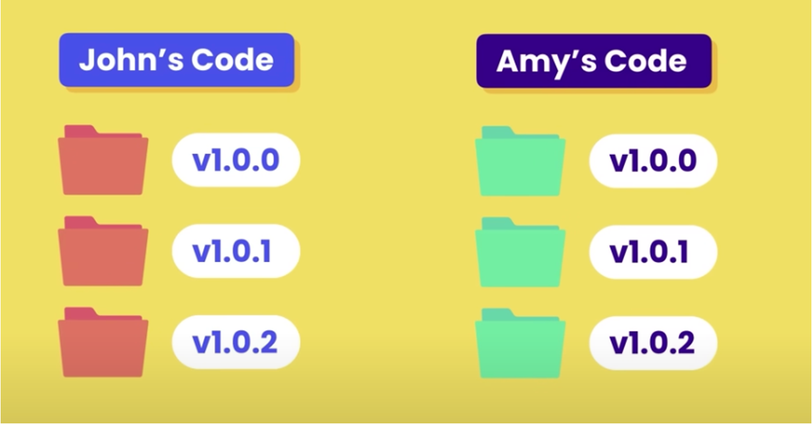<!-- .element: style="height:20vh; max-width:40vw; image-rendering: crisp-edges;" -->

[comment]: # (|||)

**Version Control Systems**
- one, central repository for the code <!-- .element: class="fragment" data-fragment-index="1" -->
- store different versions of the code <!-- .element: class="fragment" data-fragment-index="2" -->

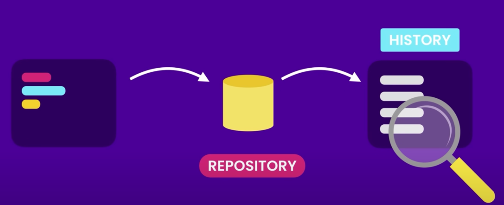<!-- .element: style="height:20vh; max-width:40vw; image-rendering: crisp-edges;" -->

[comment]: # (|||)

**Version Control Systems**
- security: restore code to a previous (running or bugfree) version <!-- .element: class="fragment" data-fragment-index="1" -->
- develop on experimental code in isolation <!-- .element: class="fragment" data-fragment-index="2" -->
- __tool for collaboration and learning__ <!-- .element: class="fragment" data-fragment-index="3" -->

<!-- .element: style="height:20vh; max-width:40vw; image-rendering: crisp-edges;" -->

[comment]: # (|||)

__Why Git?__
- It's open source <!-- .element: class="fragment" data-fragment-index="1" -->
- It's free <!-- .element: class="fragment" data-fragment-index="2" -->
- It's cheap in terms of usage in memory and CPU <!-- .element: class="fragment" data-fragment-index="3" -->
- It scales really well from local usage to thousands of users <!-- .element: class="fragment" data-fragment-index="4" -->
- It's lightning fast! <!-- .element: class="fragment" data-fragment-index="6" -->

*De-facto software industry standard* <!-- .element: class="fragment" data-fragment-index="7" -->

[comment]: # (|||)

What's the difference between Git and GitHub/GitLab?

Git is the Git of GitHub/Lab <!-- .element: class="fragment" data-fragment-index="1" -->

[comment]: # (|||)

They are referred to as *the remote* and a *git forge*<!-- .element: class="fragment" data-fragment-index="1" -->
- an extra layer of (remote) storage <!-- .element: class="fragment" data-fragment-index="2" -->
- a lot of DevOps tooling <!-- .element: class="fragment" data-fragment-index="3" -->
- project management <!-- .element: class="fragment" data-fragment-index="4" -->
- wikis and documentation spaces <!-- .element: class="fragment" data-fragment-index="5" -->

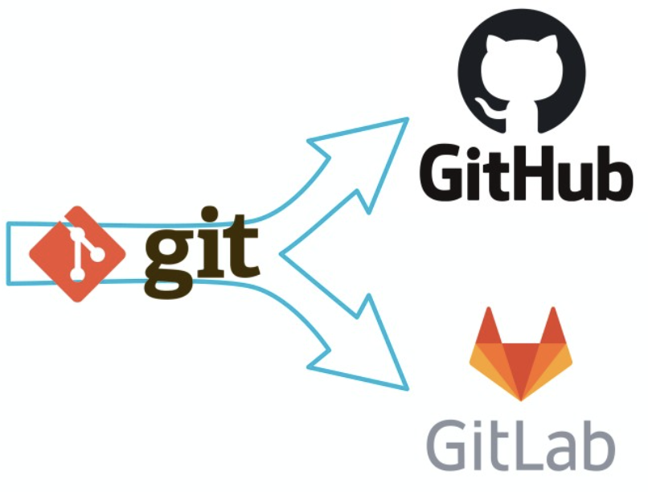<!-- .element: style="height:20vh; max-width:40vw; image-rendering: crisp-edges;" -->

[comment]: # (!!!)

## Git basics
vocabulary and workflow

[comment]: # (|||)

Ways of working with Git

- GUI and IDEs <!-- .element: class="fragment" data-fragment-index="1" -->
	- GitHub, GitLab, Azure DevOps... <!-- .element: class="fragment" data-fragment-index="2" -->
	- VS Code, JetBrains... <!-- .element: class="fragment" data-fragment-index="3" -->
- command line <!-- .element: class="fragment" data-fragment-index="4" -->

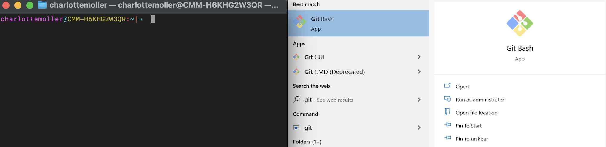 <!-- .element: style="max-height:30vh; max-width:50vw; image-rendering: crisp-edges;" -->

[comment]: # (|||)

*Today we'll use the command line*

- familiarize ourselves with Git <!-- .element: class="fragment" data-fragment-index="1" -->
- learn concepts and a vocabulary working on files locally <!-- .element: class="fragment" data-fragment-index="2" -->
- implementation differs from VS Code, JetBrains, Github, GitLab and all the others clients <!-- .element: class="fragment" data-fragment-index="3" -->
	
*but the logic stays the same* <!-- .element: class="fragment" data-fragment-index="4" -->


[comment]: # (|||)

The Git workflow

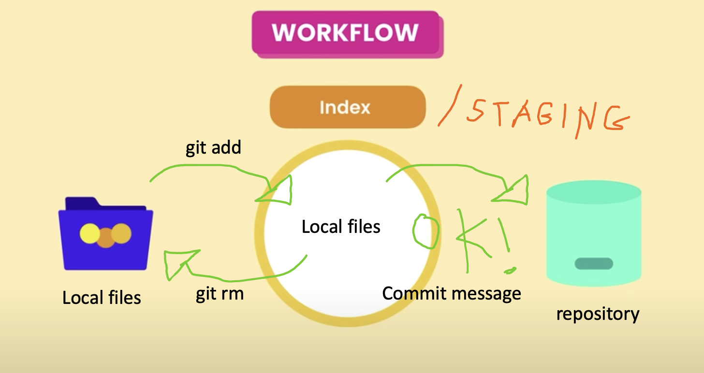 <!-- .element: style="height:40vh; max-width:80vw; image-rendering: crisp-edges;" -->

[comment]: # (|||)

*let's get started...*

- Mac- and Linux users -> *open your terminal*
- Windows users -> *launch Git bash*


 <!-- .element: style="height:30vh; max-width:50vw; image-rendering: crisp-edges;" -->

[comment]: # (|||)

Before starting, we need to assure that everybody has configured the same branch as default branch 

```js 
git config --global init.defaultBranch main
```
(we'll talk about branches later)

[comment]: # (|||)

*Let's prepare a folder to work in*

In your terminal/Git Bash, type these commands one by one

```js [1|2|3|4]
mkdir git_workshop 'this creates a new, empty folder'
cd git_workshop 'we change directory (cd) to that folder'
git init 'now, we have created a new git project'
ls -la 'lists the content, notice the hidden .git folder'
```
<!-- .element: data-id="code" -->


[comment]: # (|||)

*Let's create our first snapshot*

```js [1|2|3|4|5|6]
echo hello > file1.txt 'create a textfile with "hello" in it'
echo hello > file2.txt 'create another textfile'
git status 'git keeps track of the new files in red'
git add * 'we store the files in staging'
git status 'the files are now listed in green'
git commit -m "add file1 and file2" 'type message about this commit'
```
<!-- .element: data-id="code" -->

[comment]: # (|||)

**Congratulations!**

You've created your first snapshot

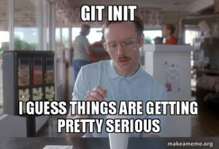 <!-- .element: style="height:40vh; max-width:250vw; image-rendering: crisp-edges;" -->

[comment]: # (|||)

**Recap - vocabulary**

Local files -> this is our working environment. Git call it working tree <!-- .element: class="fragment" data-fragment-index="1" -->

Staging/index -> the intermediate storage <!-- .element: class="fragment" data-fragment-index="2" -->

a 'commit' -> a snapshot in your repository, that you can go back to <!-- .element: class="fragment" data-fragment-index="3" -->

 <!-- .element: style="max-height:20vh; max-width:15vw; image-rendering: crisp-edges;" -->

[comment]: # (|||)

**Important Git commands**

*the workflow*

```js [1|2|3|4]
git status 'compares local files with staging'
git add <filename> 'add a file to staging'
git reset <filename> 'remove files from staging'
git commit -m "my commit message" 'creates a snapshot'
```
<!-- .element: data-id="code" -->

[comment]: # (|||)

Are you seeing something like this?

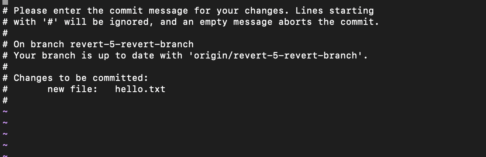 <!-- .element: style="max-height:50vh; max-width:60vw; image-rendering: crisp-edges;" -->

Welcome to your first [Vim](https://en.wikipedia.org/wiki/Vim_(text_editor)) screen 

That's because you forgot the '-m "some commit message"' <!-- .element: class="fragment" data-fragment-index="2" -->


[comment]: # (|||)

To get rid of it, type on your keyboard:
- ESC (just to be sure to start off a clean plate)
- I -> this is for Insert mode
- move the cursor to an un-commented line (~)
- type your commit message
- ESC
- ':wq' + Enter (this tells Vim to Write and Quit)


[comment]: # (|||)

 <!-- .element: style="max-height:60vh; max-width:80vw; image-rendering: crisp-edges;" -->

[comment]: # (|||)

Learn Vim in a nice way by playing a [game](https://vim-adventures.com/)

or

set your default text editor to your preferred text editor on your system using this command

```js
git config –global core.editor “<path to editor> –wait”
```

[comment]: # (|||)

Let's try it out ...

(it's bound to happen at some point in time)


[comment]: # (!!!)

## Working in isolation
branches, merge and merge conflicts

[comment]: # (|||)

**Classic Git workflow**

- one mainline of code <!-- .element: class="fragment" data-fragment-index="1" -->
	- usually called main or master by convention <!-- .element: class="fragment" data-fragment-index="2" -->

- new code is developed in a separate branch <!-- .element: class="fragment" data-fragment-index="3" -->
	- keep the mainline secure and executable <!-- .element: class="fragment" data-fragment-index="4" -->
	- keep a clear trace of the code's history <!-- .element: class="fragment" data-fragment-index="5" -->

- when the new code is ready, merge to mainline <!-- .element: class="fragment" data-fragment-index="6" -->

[comment]: # (|||)

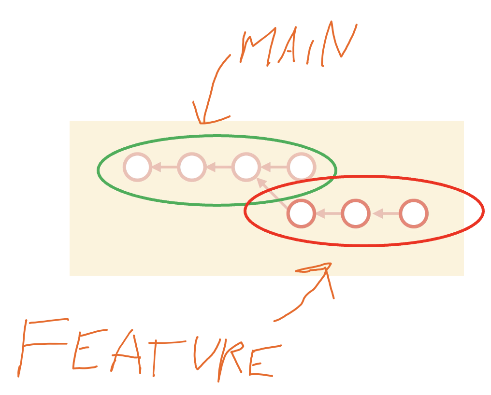 <!-- .element: style="max-height:50vh; max-width:80vw; image-rendering: crisp-edges;" -->

[comment]: # (|||)


[Branches](https://git-scm.com/book/ms/v2/Git-Branching-Branches-in-a-Nutshell) in Git are great because:
- it's just a [pointer](https://en.wikipedia.org/wiki/Pointer_(computer_programming)) and doesn't require a lot of copying files
- it's super fast to switch between branches
- Git keeps track of where we are using the pointer [HEAD](https://www.geeksforgeeks.org/git/git-head/)


[comment]: # (|||)

*Let's try it out*

```js [1|2|3|4|5|6|7]
git switch -C bugfix/fix_this 'creates a branch and switches to it'
echo 'fix this, darling' >> file1.txt 'append some text'
cat file1.txt 'output the file, has text been added?'
git status 'git detects changes'
git add file1.txt 'add the file to staging'
git status 'check that it was added'
git commit -m "fixed the bug" 'preferably a meaningful message'
```
<!-- .element: data-id="code" -->

*this is the classic Git workflow* <!-- .element: class="fragment" data-fragment-index="9" -->

[comment]: # (|||)

 <!-- .element: style="max-height:40vh; max-width:80vw; image-rendering: crisp-edges;" -->

[comment]: # (|||)

**READY? Let's go!**

```js [1|2|3|4]
git switch main 'go back to main branch'
cat file1.txt 'notice, our file is back to old state'
git merge bugfix/fix_this 'merge the change to main'
cat file1.txt 'Yay! We merge the two branches'
```
<!-- .element: data-id="code" -->


[comment]: # (|||)

Often, more than one person is working on a project
*we'll have more than one active branch*

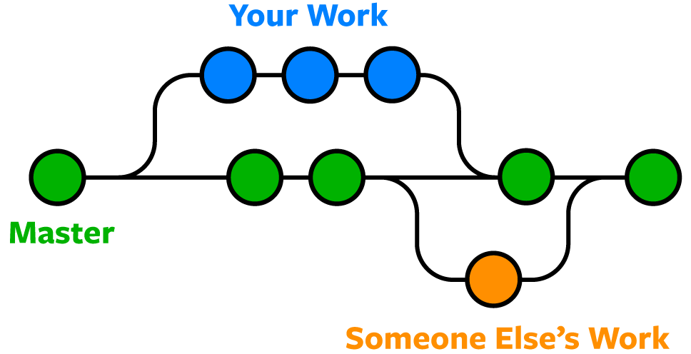 <!-- .element: style="max-height:30vh; max-width:80vw; image-rendering: crisp-edges;" -->

**this is usually how merge conflicts occur** <!-- .element: class="fragment" data-fragment-index="1" -->

[comment]: # (|||)

**A merge conflict occurs if**

- The same line of code has been changed in two branches <!-- .element: class="fragment" data-fragment-index="1" -->
- A file has been changed in one branch and deleted in another <!-- .element: class="fragment" data-fragment-index="2" -->
- The same file is added in two branches, but the content is different <!-- .element: class="fragment" data-fragment-index="3" -->

*Git doesn’t know how to resolve this, you'll have to do it* <!-- .element: class="fragment" data-fragment-index="4" -->

[comment]: # (|||)

**Ready for some merge conflict?**

Go back to your terminal... <!-- .element: class="fragment" data-fragment-index="1" -->


[comment]: # (|||)

First, let's make some changes on the file in a new branch

```js [1|2|3|4]
git switch -C feature/new_stuff 'create a new branch'
echo 'from new branch' >> file1.txt 'append some text'
git add file1.txt 'add the file to staging'
git commit -m "changes from new branch"
```
<!-- .element: data-id="code" -->

[comment]: # (|||)

Now, let's go back to main and change the **same** file

```js [1|2|3|4]
git switch main 
echo 'from main' >> file1.txt 'append some text'
git add file1.txt 'add the file to staging'
git commit -m "changes from main"
```
<!-- .element: data-id="code" -->

[comment]: # (|||)

Now, we're in trouble!. If I do

```js
git merge feature/new_stuff
```

I get

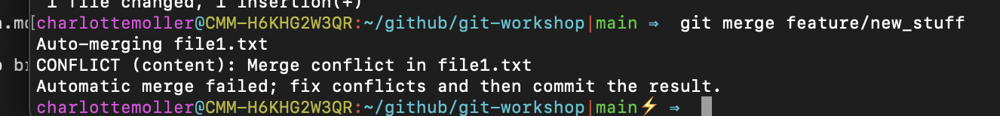 <!-- .element: style="max-height:30vh; max-width:50vw; image-rendering: crisp-edges;" -->

[comment]: # (|||)

Open file1.txt in ANY text editor

*in this case, sublime*

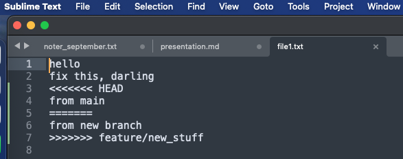 <!-- .element: style="max-height:30vh; max-width:50vw; image-rendering: crisp-edges;" -->


Git adds branch-info, markers and divider by default

[comment]: # (|||)

This is how to proceed

- edit it manually <!-- .element: class="fragment" data-fragment-index="1" -->
- save <!-- .element: class="fragment" data-fragment-index="2" -->

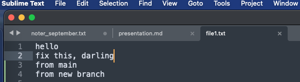 <!-- .element: style="max-height:30vh; max-width:50vw; image-rendering: crisp-edges;" -->

[comment]: # (|||)

Go back to the terminal 

```js [1|2|3]
git status 'changes detected by git'
git add file1.txt 'add the file to staging'
git commit -m "fixed merge conflict"
```
<!-- .element: data-id="code" -->

And that's it! <!-- .element: class="fragment" data-fragment-index="1" -->

[comment]: # (|||)

**This deserves a round of applause**

 <!-- .element: style="max-height:30vh; max-width:50vw; image-rendering: crisp-edges;" -->

[comment]: # (|||)

**Could this have been avoided?**

<div style="font-size: 2em;">BAD NEWS!</div> <!-- .element: class="fragment" data-fragment-index="1" -->

In this case, we edited the same file AND the same line <!-- .element: class="fragment" data-fragment-index="2" -->

Manual fixing is the only way <!-- .element: class="fragment" data-fragment-index="3" -->

[comment]: # (|||)

**Recap - vocabulary**

Branches allow to work on code in isolation <!-- .element: class="fragment" data-fragment-index="1" -->

The pointer HEAD is always pointing to our current state <!-- .element: class="fragment" data-fragment-index="2" -->

Merge conflicts occur when the same file has been edited in more than one branch <!-- .element: class="fragment" data-fragment-index="3" -->


[comment]: # (|||)

Let's try a real life scenario with branching and merging out in Github

- go to https://github.com/Charleau-hub/collab-code-repo
- clone it to your laptop or edit it in the web UI
- try to follow instructions in the README

[comment]: # (!!!)

## A closer look at how Git keeps track of changes
(This is the nerdy chapter)


[comment]: # (|||)

We start out in an empty working directory

**git init** creates the .git, in which we'll find Git objects like: 
- HEAD <!-- .element: class="fragment" data-fragment-index="1" -->
- configuration <!-- .element: class="fragment" data-fragment-index="2" -->
- objects <!-- .element: class="fragment" data-fragment-index="3" -->
- refs <!-- .element: class="fragment" data-fragment-index="4" -->
- .. <!-- .element: class="fragment" data-fragment-index="5" -->

Initially, all these objects are empty <!-- .element: class="fragment" data-fragment-index="6" -->


And, if I delete the .git folder, the folder is back to just a normal folder <!-- .element: class="fragment" data-fragment-index="7" -->


[comment]: # (|||)

Once we start working on files, git creates objects to track changes.

The most important ones are stored in .git/objects <!-- .element: class="fragment" data-fragment-index="1" -->
- .git/index is a binary file keeping track of the staging area <!-- .element: class="fragment" data-fragment-index="2" -->
- .git/HEAD is our current branch <!-- .element: class="fragment" data-fragment-index="3" -->


[comment]: # (|||)

The Git history is

- the graph that Git builds of branches and merges <!-- .element: class="fragment" data-fragment-index="1" -->
- allows to do time travel <!-- .element: class="fragment" data-fragment-index="2" -->
- it can be visualized and inspected using graphical tools or the command line <!-- .element: class="fragment" data-fragment-index="3 -->


[comment]: # (|||)

If you are collaborating with others, you are sharing your git history and the git objects
- consistency between collaborators <!-- .element: class="fragment" data-fragment-index="1" -->
- if there are differences, you'll have to reconcile the history manually <!-- .element: class="fragment" data-fragment-index="2" -->

[comment]: # (|||)

Let's have a look in the terminal

Note:
git log --oneline --graph 

ls -la .git  

cat .git/HEAD 

ls -la .git/objects

show git graph


[comment]: # (|||)

*Remember the merge conflict?*

Working on the same files is source of trouble <!-- .element: class="fragment" data-fragment-index="1" -->

*Be certain to get latest changes from the main line BEFORE a merge* <!-- .element: class="fragment" data-fragment-index="2" -->
<div style="font-size: 0.5em;">(even seasoned developers will forget this from time to time and get nasty suprises)</div> <!-- .element: class="fragment" data-fragment-index="3" -->

[comment]: # (|||)


There are two [approaches](https://www.atlassian.com/git/tutorials/merging-vs-rebasing) to get around this:

- pull latest changes from main line and merge to your branch BEFORE you merge back to main line <!-- .element: class="fragment" data-fragment-index="1" -->

- rebase you branch <!-- .element: class="fragment" data-fragment-index="2" -->

They differ in the way your git history looks afterwards <!-- .element: class="fragment" data-fragment-index="3" -->

[comment]: # (|||)

Rebasing your branch will:

- move the entire new branch to being on the tip of the main branch <!-- .element: class="fragment" data-fragment-index="1" -->
- incorporate all of your new commits commits into the mainline <!-- .element: class="fragment" data-fragment-index="2" -->

*The Git history of the main line is re-written from the point in time when you branched out* <!-- .element: class="fragment" data-fragment-index="3" -->

This is a problem if you are sharing you main line with others<!-- .element: class="fragment" data-fragment-index="3" -->

[comment]: # (|||)

Merging your branch with main will:

- incorporate the main line INTO your branch <!-- .element: class="fragment" data-fragment-index="1" -->

*The Git history of the main line is preserved* <!-- .element: class="fragment" data-fragment-index="3" -->

[comment]: # (|||)

*We don't have a remote main line with changes, so let's try the rebasing ...*

[comment]: # (|||)

Firstly, we need to create a new branch and make some changes

```js [1|2|3|4]
git switch -C my_branch 'create a new branch'
echo 'this is from my brand new branch' >> file1.txt 'append some text'
cat file1.txt 'was text added?'
git add file1.txt 'add the file to staging'
git commit -m "me brancing out from main"
```
<!-- .element: data-id="code" -->

[comment]: # (|||)

Now, we go back to main and make some change

ATTENTION! I'm adding text to file2.txt!

```js [1|2|3|4]
git switch main 'go back to main line'
echo 'my main line is calling earth' >> file2.txt 'append some text'
git add file2.txt 'add the file to staging'
git commit -m "calling earth from main line"
```

[comment]: # (|||)

In our other branch, before merging our changes to main 
**we rebase to get the latest changes from main** 

```js [1|2|3|4]
git switch my_branch 'go back to our branch'
git rebase main 'this is where we get the latest changes from main'
cat file1.txt 'Does it look correct?'
cat file2.txt 'Does it look correct?'
```

[comment]: # (|||)

Now, we're reday to merge our changes to main

```js [1|2]
git switch main 'go back to main line'
git merge my_branch 'we can merge'
```
<!-- .element: data-id="code" -->

[comment]: # (|||)
Comparing rebasing and merge on our little example:

<div style="display: flex; justify-content: space-between; align-items: center;">
  <figure style="text-align: center; width: 48%;">
    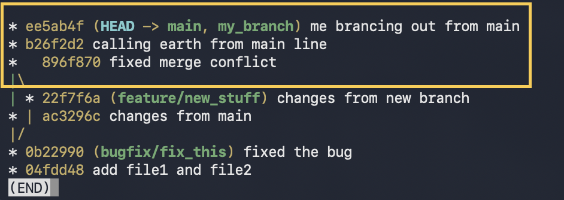
    <figcaption>Git history with rebasing</figcaption>
  </figure>
  <figure style="text-align: center; width: 48%;">
    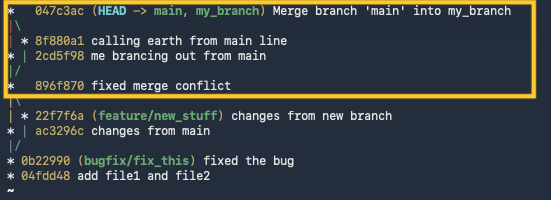
    <figcaption>.. and with merge</figcaption>
  </figure>
</div>

Rebasing is used to obtain a clear, linear git history


[comment]: # (|||)

**Good advice coming from experience**

- Give clear name to brances <!-- .element: class="fragment" data-fragment-index="1" -->
	- try to align on a convention followed by the team <!-- .element: class="fragment" data-fragment-index="2" -->
- ALWAYS get the latest changes from the main line (apply rebase or pull and merge with main line)<!-- .element: class="fragment" data-fragment-index="3" -->

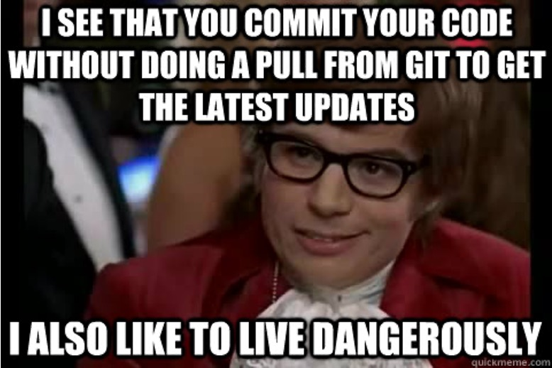 <!-- .element: style="max-height:30vh; max-width:60vw; image-rendering: crisp-edges;" -->

[comment]: # (!!!)

## Exploring your code history
*Or, how to save your team the day someone deployes bad code*
<div style="font-size: 0.5em;">
Always on fridays...
</div>

[comment]: # (|||)

By now, we've already created some entries in our Git repo

*let's check them out*

```js [1-2|3-4]
git log 'the raw version'
'to quit, press "q"'
git log --pretty --oneline --graph 'pretty version'
'to quit, press "q"'
```
<!-- .element: data-id="code" -->q


[comment]: # (|||)

Mine looks like this

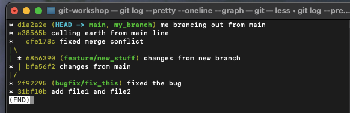 <!-- .element: style="max-height:30vh; max-width:60vw; image-rendering: crisp-edges;" -->

- the hash is the value of HEAD in that particular moment in time
- it allows us to do time travel

*notice how branch names and commit messages suddenly become important*

[comment]: # (|||)

Ready for some time travel?

 <!-- .element: style="max-height:30vh; max-width:60vw; image-rendering: crisp-edges;" -->

Git has three commands for travelling in time... <!-- .element: class="fragment" data-fragment-index="1" -->

[comment]: # (|||)

**git reset 'commit-hash' \--hard|medium|soft**

erases bad commits and restores to a previous step <!-- .element: class="fragment" data-fragment-index="1" -->

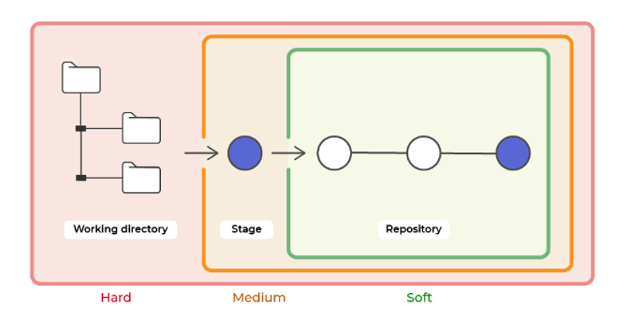 <!-- .element: style="max-height:40vh; max-width:60vw; image-rendering: crisp-edges;" -->

[comment]: # (|||)

**git revert 'commit-hash'**

creates a new commit on top of your git history containing the old state<!-- .element: class="fragment" data-fragment-index="1" -->

[comment]: # (|||)

**git checkout 'commit-hash'** 

let's you access a previous commit BUT puts your work dir in "detached HEAD" state  <!-- .element: class="fragment" data-fragment-index="3" -->

[comment]: # (|||)

The least damaging one (from the perspective of preserving the git history)

**revert**

But most people use brute force with (out of laziness)

**reset  - - hard**

[comment]: # (|||)

Today, I'd like to demonstrate
- checkout <!-- .element: class="fragment" data-fragment-index="1" -->
- reset <!-- .element: class="fragment" data-fragment-index="2" -->

Go back to the terminal ... <!-- .element: class="fragment" data-fragment-index="3" -->


[comment]: # (|||)

**Checkout**
- a command that has many usages  <!-- .element: class="fragment" data-fragment-index="1" -->
- we'll focus on the time travelling part <!-- .element: class="fragment" data-fragment-index="2" -->

Imagine that you'd like to reset a file to a previous state ..<!-- .element: class="fragment" data-fragment-index="2" -->


[comment]: # (|||)

*Firstly, identify the commit you want to checkout*

```js [1|2-3]
git log 'the raw version'
git log --pretty --oneline --graph 'pretty version'
'to quit, press "q"'
```
<!-- .element: data-id="code" -->

copy the 7 caracter commit-hash

[comment]: # (|||)

*Now, you can checkout a file (or the entire repo) at that moment in time*

```js [1|2]
git checkout <insert copied hash> -f file1.txt
cat file1.txt 'check that we are looking at a previous version'
```
<!-- .element: data-id="code" -->

Now, you can either add and commit it or go back by doing a 
```js
git checkout main -f file1.txt
```
<!-- .element: data-id="code" -->


[comment]: # (|||)

**Reset**

we will be rewriting history and can potentially cause damage

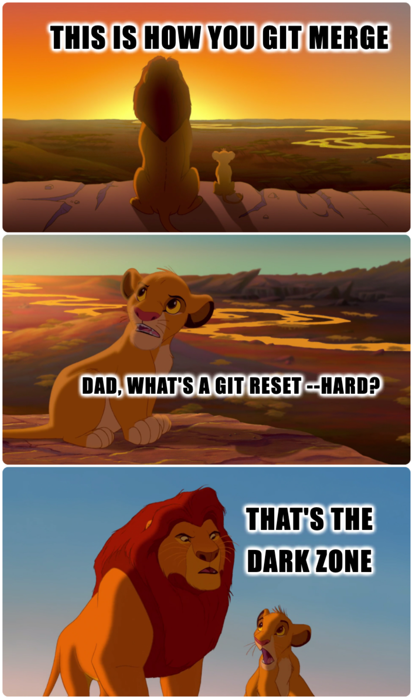 <!-- .element: style="max-height:60vh; max-width:100vw; image-rendering: crisp-edges;" -->

[comment]: # (|||)

*Firstly, identify the commit you want to reset to*

```js [1|2-3]
git log 'the raw version'
git log --pretty --oneline --graph 'pretty version'
'to quit, press "q"'
```
<!-- .element: data-id="code" -->

copy the 7 caracter commit-hash

[comment]: # (|||)

*Paste the commit-hash into the command*

```js [1-2|3-4]
git reset <commit-hash> --hard 
'entirely erases what happened after this commit'
git log --pretty --oneline --graph 'pretty version'
'to quit, press "q"'
```
<!-- .element: data-id="code" -->

Notice how the git log looks like now

[comment]: # (|||)

**BEWARE!**

If you're sharing your branch with others, it will screw up their git history <!-- .element: class="fragment" data-fragment-index="1" -->

If you're on a throw away branch or your own branch, you're fine<!-- .element: class="fragment" data-fragment-index="2" -->

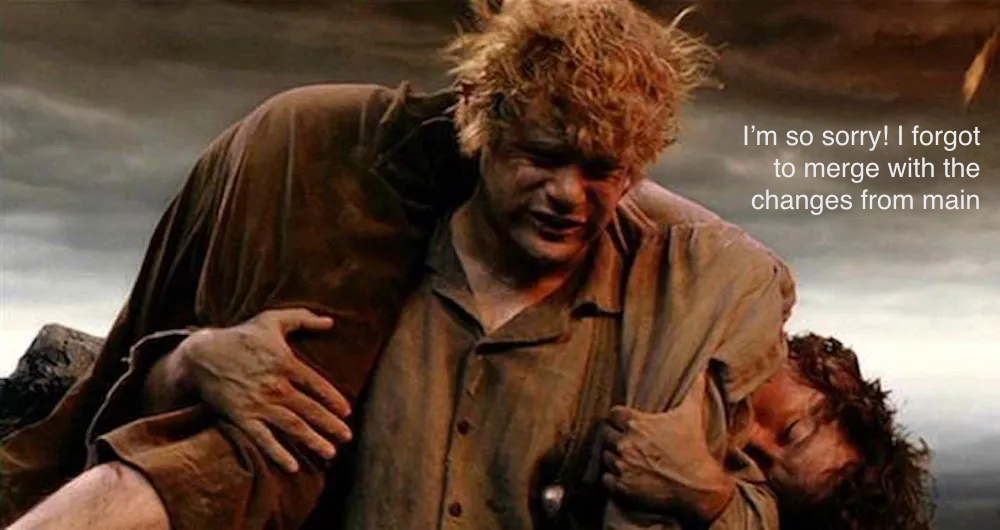 <!-- .element: style="max-height:20vh; max-width:60vw; image-rendering: crisp-edges;" -->

Usually not allowed on the main line <!-- .element: class="fragment" data-fragment-index="3" -->


[comment]: # (|||)

When collaborating with others

*to be avoided*

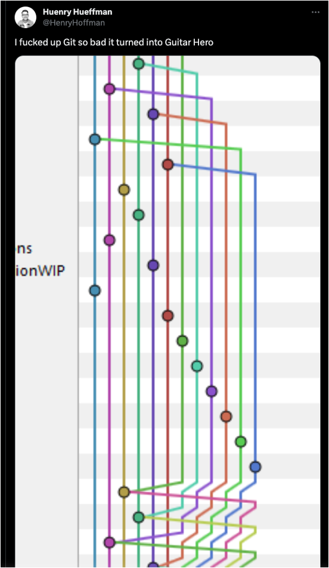 <!-- .element: style="max-height:60vh; max-width:60vw; image-rendering: crisp-edges;" -->

[comment]: # (|||)

Instead, aim for linear

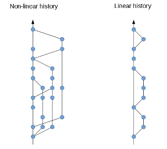

To obtain this, people use
- rebasing
- [squashing](https://www.geeksforgeeks.org/git/git-squash/) to avoid too many small commits


[comment]: # (!!!)

## Where to go from here

[comment]: # (|||)


 <!-- .element: style="max-height:20vh; max-width:60vw; image-rendering: crisp-edges;" -->

You survived this crash course on Git!

[comment]: # (|||)

How to get help with git 

```js
git --help 'this will list the commands'
git <command> --help 'get more detailed info on the command'
'press <q> to quit'
```
<div style="font-size: 0.5em;">
This might not feel very helpfull in the beginning
</div>

[Git cheat sheet](https://education.github.com/git-cheat-sheet-education.pdf)

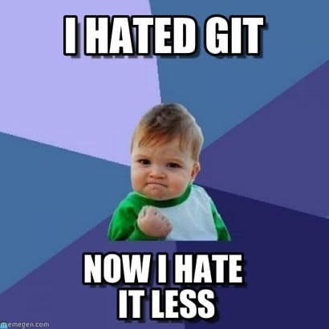 <!-- .element: style="max-height:20vh; max-width:60vw; image-rendering: crisp-edges;" -->

[comment]: # (|||)


I got inspired and borrowed from [Code with Mosh](https://codewithmosh.com/p/the-ultimate-git-course)

<iframe width="560" height="315" src="https://www.youtube.com/embed/8JJ101D3knE?si=xlypA5jy344SKqb2" title="YouTube video player" frameborder="0" allow="accelerometer; autoplay; clipboard-write; encrypted-media; gyroscope; picture-in-picture; web-share" referrerpolicy="strict-origin-when-cross-origin" allowfullscreen></iframe>

A deep dive on the internals of Git can be found [here](https://octobot.medium.com/how-git-internally-works-1f0932067bee)


[comment]: # (|||)

This was created using [markdown-slides](https://gitlab.com/da_doomer/markdown-slides)!

*a beautiful example of the benefits of sharing and collaborating* <!-- .element: class="fragment" data-fragment-index="1" -->

[comment]: # (|||)

Happy coding!


